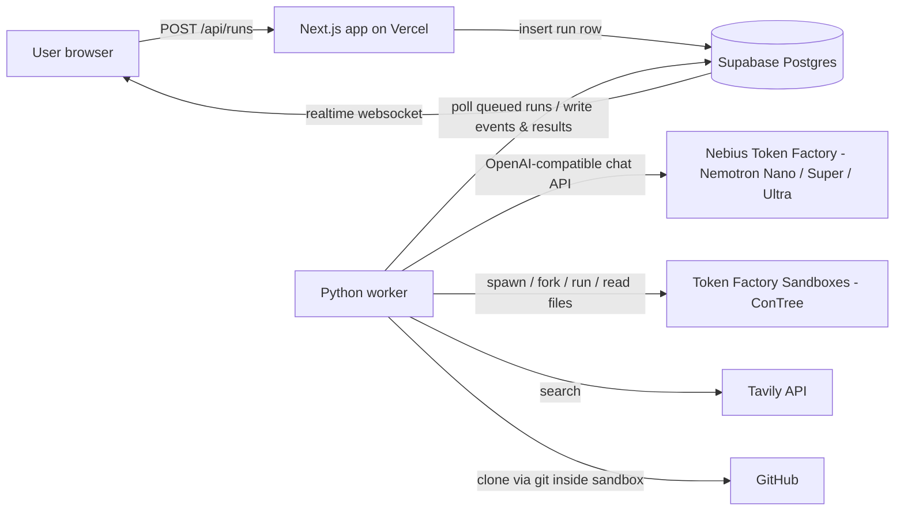

# 01 — Architecture

## System overview



Two deployable components, one database:

| Component | Directory | Tech | Hosting (free) | Responsibility |
| --- | --- | --- | --- | --- |
| Web | `web/` | Next.js 15 (App Router) + TypeScript + Tailwind + shadcn/ui | Vercel free tier | UI, REST API, reads DB, subscribes to realtime |
| Worker | `worker/` | Python 3.12, no framework (plain asyncio) | Runs on your laptop for dev; for judging week run it in a cheap always-on place — first choice: a Nebius Serverless Job / small instance paid by hackathon credits (extra sponsor points); fallback: keep laptop running with `EXECUTOR=contree` | The entire agent pipeline: sandbox orchestration, LLM calls, DB writes |
| Database | (Supabase cloud) | Postgres + Realtime | Supabase free tier | Single source of truth; realtime channel to browser |

**Why worker-polls-DB instead of a message queue:** zero extra infrastructure, works from any machine with the service-role key, restart-safe (state machine lives in Postgres), and free. Claim jobs with `SELECT ... FOR UPDATE SKIP LOCKED`.

**Why Python for the worker:** the Sandboxes SDK (`contree-sdk`) is Python-first, the LLM calls are OpenAI-compatible (`openai` pip package with custom `base_url`), and subprocess/git/diff tooling is simplest in Python.

**Why the web app never talks to sandboxes:** Vercel serverless functions have short execution limits; a pipeline run takes minutes. The web tier only enqueues rows and renders DB state. All long-running work happens in the worker.

## Repo layout (monorepo)

```
/
├── README.md
├── LICENSE                  # MIT — required visible by hackathon rules
├── docs/                    # this plan
├── .cursor/rules/           # Cursor project rules (see 06)
├── web/
│   ├── app/
│   │   ├── page.tsx             # home: paste URL, gallery of recent runs
│   │   ├── runs/[slug]/page.tsx # live run view + final report
│   │   ├── leaderboard/page.tsx # OSS flakiness leaderboard (M8)
│   │   └── api/
│   │       ├── runs/route.ts            # POST (create), GET (list)
│   │       └── runs/[id]/route.ts       # GET detail
│   │       └── runs/[id]/cancel/route.ts
│   │       └── runs/[id]/report.md/route.ts
│   │       └── runs/[id]/patch.diff/route.ts
│   ├── lib/ (supabase clients, types, zod schemas)
│   └── components/ (see 07-UI-SPEC)
├── worker/
│   ├── flakeproof/
│   │   ├── main.py              # poll loop, claims runs, drives state machine
│   │   ├── config.py            # env + run config defaults
│   │   ├── db.py                # supabase/postgres helpers, event emitter
│   │   ├── llm.py               # Nemotron client, model router, call logging
│   │   ├── executors/
│   │   │   ├── base.py          # SandboxExecutor interface
│   │   │   ├── contree.py       # real Token Factory Sandboxes
│   │   │   ├── docker_local.py  # local Docker fallback (dev without credits)
│   │   │   └── mock.py          # scripted fake runs (UI dev, tests, offline)
│   │   ├── stages/
│   │   │   ├── s0_intake.py
│   │   │   ├── s1_provision.py
│   │   │   ├── s2_detect.py
│   │   │   ├── s3_diagnose.py
│   │   │   ├── s4_fix.py
│   │   │   ├── s5_verify.py
│   │   │   └── s6_report.py
│   │   ├── perturbations.py     # the perturbation matrix (see 03)
│   │   ├── pytest_parse.py      # JUnit XML / pytest output parsing
│   │   └── tavily_enrich.py
│   ├── tests/                   # pytest for the worker itself (mock executor)
│   └── requirements.txt
└── supabase/
    └── migrations/0001_init.sql # full schema from 02-DATABASE.md
```

## The executor abstraction (the most important design decision)

Everything that touches a sandbox goes through one interface, so the whole product can be built and demoed **before we have working credits**, and so a Docker fallback exists if the beta Sandboxes API surprises us.

```python
class SandboxExecutor(Protocol):
    async def create_env(self, base_image: str) -> EnvHandle:
        """Start from a base image (e.g. python:3.12-slim). Returns handle to current checkpoint."""

    async def run(self, env: EnvHandle, command: str, *, timeout_s: int,
                  env_vars: dict[str, str] | None = None) -> RunResult:
        """Execute a shell command FROM the given checkpoint. Returns exit code, stdout, stderr,
        duration, and the NEW checkpoint handle produced by the run (git-like: every run = new node)."""

    async def fork_and_run(self, env: EnvHandle, commands: list[SandboxCommand],
                           *, concurrency: int) -> list[RunResult]:
        """THE branching primitive: run N commands in parallel, each in its own fork
        of the SAME checkpoint. Identical starting state for every branch."""

    async def read_file(self, env: EnvHandle, path: str) -> str: ...
    async def write_file(self, env: EnvHandle, path: str, content: str) -> EnvHandle: ...
```

- `ContreeExecutor` maps this to the Sandboxes API (spawn instance from image, poll operation, read artifacts/files, fork = spawn N instances from the same image id). Details + endpoints in `04-API.md`.
- `DockerExecutor` approximates checkpoints with `docker commit` (slower, weaker isolation — dev only).
- `MockExecutor` replays a scripted scenario matching the demo repo (see `08`), with realistic delays, so the UI can be built end-to-end offline.

Concurrency budget: Sandboxes beta limits **50 concurrent instances**; we run waves with `MAX_CONCURRENT_SANDBOXES=10` by default (configurable) so multiple runs can coexist.

## LLM routing (mirrors what the hackathon page recommends)

| Alias (env var) | Model family | Used for |
| --- | --- | --- |
| `NEMOTRON_FAST_MODEL` | Nemotron Nano | log parsing, failure normalization, install-error triage, patch sanity review, report prose |
| `NEMOTRON_SMART_MODEL` | Nemotron Super or Ultra | root-cause classification, patch generation |

- Client: `openai` Python package with `base_url=TOKEN_FACTORY_BASE_URL`.
- **Do not hardcode model IDs** — the exact catalog IDs must be read from the Token Factory model list at build time and set via env. (Known from hackathon materials: Nemotron-3 family incl. Nano, Super 120B with 1M context + native function calling, Ultra.)
- Every call is logged to the `llm_calls` table (model, purpose, tokens, latency) — this powers the "How we used Nemotron" panel in the UI and the Devpost writeup.

## Environment variables

`web/.env.local`:

```bash
NEXT_PUBLIC_SUPABASE_URL=
NEXT_PUBLIC_SUPABASE_ANON_KEY=
SUPABASE_SERVICE_ROLE_KEY=        # server-side only (route handlers)
APP_BASE_URL=http://127.0.0.1:4310
```

`worker/.env`:

```bash
SUPABASE_URL=
SUPABASE_SERVICE_ROLE_KEY=
EXECUTOR=mock                     # mock | docker | contree
NEBIUS_API_KEY=                   # Token Factory key (inference + sandboxes)
NEBIUS_PROJECT_ID=
TOKEN_FACTORY_BASE_URL=https://api.studio.nebius.ai/v1/   # VERIFY in docs at build time
CONTREE_BASE_URL=                 # VERIFY from https://docs.tokenfactory.nebius.com/llms.txt
NEMOTRON_FAST_MODEL=              # set from Token Factory catalog
NEMOTRON_SMART_MODEL=             # set from Token Factory catalog
TAVILY_API_KEY=                   # optional; feature-flagged
GITHUB_TOKEN=                     # optional; raises GitHub API rate limits
MAX_CONCURRENT_SANDBOXES=10
MAX_ACTIVE_RUNS=2                 # worker-level cap
```

Both directories ship `.env.example` files with these keys and comments.

## Ports & local dev

- Web dev server: **port 4310** (uncommon on purpose). `npm run dev -- -p 4310`.
- Worker: no port; long-running process `python -m flakeproof.main`.
- Local order: start Supabase project (cloud, nothing local), `web` dev server, worker in mock mode. Full-stack demo works with zero credentials except Supabase.

## Failure & restart semantics

- The run's `status` column is the state machine (see `03-PIPELINE.md`). The worker updates it transactionally per stage.
- Worker crash mid-run: on restart, runs stuck `in_progress` past `stale_after` (updated_at + 15 min) are marked `failed` with `error='worker lost'`; user can retry. (Resumable stages are a stretch goal — checkpoint IDs are stored, so provision can be skipped on retry of the same commit SHA.)
- Every stage writes structured `run_events` rows; the UI log console is a direct render of that table. Nothing user-visible is only in worker stdout.
