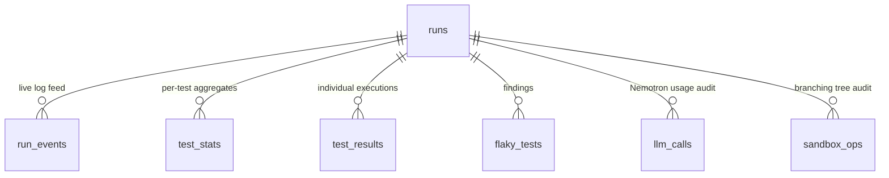

# 02 — Database

## Choice: Supabase (free tier)

| Considered | Verdict |
| --- | --- |
| **Supabase Postgres** | ✅ Chosen. Free tier (500 MB, no card), managed Postgres, **Realtime websockets to the browser** (the live "sandboxes lighting up" demo effect for free), row-level security, JS + Python clients. |
| Neon Postgres | Great free Postgres but no built-in browser websocket layer — we'd have to build polling/SSE ourselves. |
| SQLite | Two processes on different machines (Vercel + worker) can't share a file. |
| MongoDB Atlas | Relational data (runs → tests → results) with aggregates; SQL fits better, and Realtime is the killer feature we'd lose. |

Access pattern:

- **Web (browser):** anon key, read-only via RLS + Realtime subscriptions.
- **Web (route handlers):** service-role key, inserts `runs`.
- **Worker:** service-role key, full read/write.

## Entity relationship



## Full schema (`supabase/migrations/0001_init.sql`)

```sql
-- ============ enums ============
create type run_status as enum (
  'queued', 'provisioning', 'detecting', 'diagnosing',
  'fixing', 'verifying', 'reporting', 'done', 'failed', 'canceled'
);

create type test_outcome as enum ('passed', 'failed', 'error', 'skipped', 'timeout');

create type result_phase as enum ('detect', 'diagnose', 'verify_before', 'verify_after');

create type flaky_status as enum (
  'detected', 'diagnosing', 'diagnosed', 'fixing', 'fix_proposed',
  'verifying', 'fix_verified', 'fix_failed', 'skipped'
);

create type root_cause as enum (
  'async_race', 'order_dependent', 'time_dependent', 'network_external',
  'randomness', 'resource_leak', 'concurrency_shared_state', 'unknown'
);

-- ============ runs ============
create table runs (
  id            uuid primary key default gen_random_uuid(),
  slug          text unique not null,             -- short shareable id, e.g. 'x7Kp2mQ9aB'
  repo_url      text not null,                    -- normalized https://github.com/{owner}/{repo}
  repo_owner    text not null,
  repo_name     text not null,
  git_ref       text,                             -- requested ref (null = default branch)
  commit_sha    text,                             -- resolved by worker in S0
  status        run_status not null default 'queued',
  error         text,                             -- human-readable failure reason
  config        jsonb not null default '{}',      -- RunConfig (see 03-PIPELINE.md)
  totals        jsonb,                            -- summary written in S6 (see shape below)
  env_image_id  text,                             -- sandbox checkpoint after provision (S1)
  test_framework text,                            -- 'pytest' (MVP)
  ip_hash       text,                             -- sha256(ip + daily salt), for rate limiting
  created_at    timestamptz not null default now(),
  started_at    timestamptz,
  finished_at   timestamptz,
  updated_at    timestamptz not null default now()
);
create index runs_status_idx on runs (status) where status in ('queued');
create index runs_created_idx on runs (created_at desc);
create index runs_repo_idx on runs (repo_owner, repo_name);

-- totals jsonb shape (written by S6):
-- {
--   "tests_collected": 412, "detect_runs": 20,
--   "flaky_found": 3, "always_failing": 1,
--   "fixed_verified": 2, "fix_failed": 1,
--   "sandbox_forks": 96, "llm_calls": 41,
--   "wall_clock_s": 1104
-- }

-- ============ run_events (live log console) ============
create table run_events (
  id        bigint generated always as identity primary key,
  run_id    uuid not null references runs(id) on delete cascade,
  ts        timestamptz not null default now(),
  stage     text not null,          -- 's0_intake' ... 's6_report', 'system'
  level     text not null default 'info',  -- info | warn | error | success
  message   text not null,          -- human-readable, shown verbatim in UI
  payload   jsonb                   -- structured extras (counts, ids, durations)
);
create index run_events_run_idx on run_events (run_id, id);

-- ============ test_stats (aggregate per test per run) ============
create table test_stats (
  id            bigint generated always as identity primary key,
  run_id        uuid not null references runs(id) on delete cascade,
  test_id       text not null,      -- pytest nodeid: 'tests/test_api.py::test_retry'
  file_path     text not null,
  pass_count    int not null default 0,
  fail_count    int not null default 0,
  error_count   int not null default 0,
  timeout_count int not null default 0,
  mean_duration_ms int,
  is_flaky      boolean not null default false,   -- 0 < failures < total in detect phase
  is_always_failing boolean not null default false, -- broken, not flaky; excluded from fixing
  unique (run_id, test_id)
);
create index test_stats_run_idx on test_stats (run_id) where is_flaky;

-- ============ test_results (individual executions we keep) ============
-- To control volume we store: ALL results for flaky tests, and failures for any test.
-- Fully-passing stable tests only live in test_stats aggregates.
create table test_results (
  id            bigint generated always as identity primary key,
  run_id        uuid not null references runs(id) on delete cascade,
  test_id       text not null,
  phase         result_phase not null,
  branch_index  int not null,        -- which fork (0..N-1) in the wave
  perturbation  text not null default 'none',  -- 'none' | 'alone' | 'order' | 'cpu_stress' | 'time_shift' | 'net_off' | 'seed'
  outcome       test_outcome not null,
  duration_ms   int,
  failure_message text,              -- first line of the failure
  failure_log   text                 -- truncated to 8 KB
);
create index test_results_run_test_idx on test_results (run_id, test_id, phase);

-- ============ flaky_tests (findings & fixes) ============
create table flaky_tests (
  id              uuid primary key default gen_random_uuid(),
  run_id          uuid not null references runs(id) on delete cascade,
  test_id         text not null,
  file_path       text not null,
  failure_rate    real not null,        -- detect-phase failures / detect runs
  status          flaky_status not null default 'detected',
  root_cause      root_cause,
  confidence      real,                 -- 0..1 from the classifier
  diagnosis_md    text,                 -- human-readable explanation (Nemotron)
  evidence        jsonb,                -- perturbation matrix (see 03-PIPELINE.md for shape)
  known_reports   jsonb,                -- Tavily findings: [{title,url,snippet}]
  fix_patch       text,                 -- unified diff (test files only)
  fix_rationale_md text,
  verify_before_failures int,
  verify_after_failures  int,
  verify_total    int,
  unique (run_id, test_id)
);
create index flaky_tests_run_idx on flaky_tests (run_id);

-- ============ llm_calls (Nemotron usage audit — powers UI transparency panel) ============
create table llm_calls (
  id            bigint generated always as identity primary key,
  run_id        uuid references runs(id) on delete cascade,
  ts            timestamptz not null default now(),
  stage         text not null,
  purpose       text not null,      -- 'install_fix' | 'failure_parse' | 'root_cause' | 'patch_gen' | 'patch_review' | 'report' | 'tavily_summarize'
  model         text not null,
  prompt_tokens int,
  completion_tokens int,
  latency_ms    int,
  ok            boolean not null default true
);
create index llm_calls_run_idx on llm_calls (run_id);

-- ============ sandbox_ops (branching-tree audit — powers the tree visualization) ============
create table sandbox_ops (
  id            bigint generated always as identity primary key,
  run_id        uuid not null references runs(id) on delete cascade,
  ts            timestamptz not null default now(),
  kind          text not null,        -- 'create_env' | 'run' | 'fork_run' | 'read_file' | 'write_file'
  label         text,                 -- human label: 'detect wave fork #7', 'apply patch'
  image_in      text,                 -- parent checkpoint id
  image_out     text,                 -- resulting checkpoint id (null for reads)
  exit_code     int,
  duration_ms   int,
  status        text not null default 'ok'   -- ok | error | timeout
);
create index sandbox_ops_run_idx on sandbox_ops (run_id, id);

-- ============ updated_at trigger ============
create or replace function set_updated_at() returns trigger as $$
begin new.updated_at = now(); return new; end;
$$ language plpgsql;
create trigger runs_updated_at before update on runs
  for each row execute function set_updated_at();

-- ============ RLS ============
alter table runs         enable row level security;
alter table run_events   enable row level security;
alter table test_stats   enable row level security;
alter table test_results enable row level security;
alter table flaky_tests  enable row level security;
alter table llm_calls    enable row level security;
alter table sandbox_ops  enable row level security;

-- Public read-only (reports are shareable by design; judges need access with zero auth).
create policy "public read runs"         on runs         for select using (true);
create policy "public read run_events"   on run_events   for select using (true);
create policy "public read test_stats"   on test_stats   for select using (true);
create policy "public read test_results" on test_results for select using (true);
create policy "public read flaky_tests"  on flaky_tests  for select using (true);
create policy "public read llm_calls"    on llm_calls    for select using (true);
create policy "public read sandbox_ops"  on sandbox_ops  for select using (true);
-- No insert/update/delete policies: anon cannot write.
-- Web route handlers and the worker use the service-role key, which bypasses RLS.

-- ============ Realtime ============
-- Enable realtime broadcasts for the tables the UI subscribes to.
alter publication supabase_realtime add table runs;
alter publication supabase_realtime add table run_events;
alter publication supabase_realtime add table flaky_tests;
alter publication supabase_realtime add table sandbox_ops;
```

## Volume sanity check (free-tier fit)

A worst-case run: 500 collected tests × 20 detect runs = 10,000 executions, but stable passers are stored only as 500 `test_stats` rows. Stored `test_results` ≈ (flaky tests × all phases × ~60 rows) + stray failures ≈ low thousands of rows, each ≤ 8 KB log. Even 100 public runs stay well inside 500 MB. `run_events` is capped by emitting ≤ ~300 events per run.

## Realtime subscriptions used by the UI

| Subscription | Filter | Drives |
| --- | --- | --- |
| `runs` UPDATE | `id=eq.{run_id}` | stage stepper, status badge |
| `run_events` INSERT | `run_id=eq.{run_id}` | live log console |
| `sandbox_ops` INSERT | `run_id=eq.{run_id}` | sandbox grid / branching tree animation |
| `flaky_tests` INSERT+UPDATE | `run_id=eq.{run_id}` | findings cards appearing & progressing |

Fallback when websockets fail: the run page polls `GET /api/runs/:id` every 5 s (see `04-API.md`).

## Retention / cleanup

Free tier is fine for the hackathon window. A `cleanup` script (worker CLI flag) deletes runs older than 30 days, keeping any run flagged in a `pinned` config key (used for the runs featured in the demo video and leaderboard).
