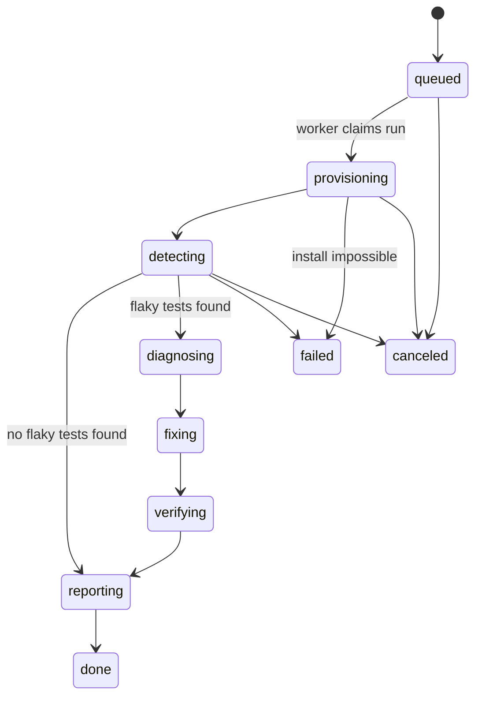

# 03 — The Agent Pipeline

Six stages, driven by a state machine stored in `runs.status`. Every stage: reads its input from the DB, does its work through the `SandboxExecutor` and/or Nemotron, writes its output to the DB, emits `run_events`, and advances the status. The worker can die and restart at any stage boundary.



## RunConfig (stored in `runs.config`, all optional at API level, defaults applied by worker)

```json
{
  "detect_runs": 20,          // forks in the detection wave (min 5, max 30)
  "verify_runs": 20,          // forks per verification wave (min 5, max 30)
  "max_flaky_to_fix": 3,      // top-N by failure rate get diagnosis+fix (max 5)
  "per_run_timeout_s": 900,   // pytest wall clock per branch
  "install_timeout_s": 900,
  "install_max_attempts": 4,  // agent-assisted install retry budget
  "perturbations": ["alone", "order", "cpu_stress", "time_shift", "net_off", "seed"],
  "diagnose_runs_per_perturbation": 6,
  "base_image": "python:3.12-slim",
  "tavily_enrichment": true,
  "pinned": false
}
```

---

## Stage 0 — INTAKE (`s0_intake.py`)

**Purpose:** validate the repo and figure out how to test it, without spending sandbox time on junk input.

| | |
| --- | --- |
| **Input** | `runs` row: `repo_url`, `git_ref`, `config` |
| **Output** | `runs.commit_sha`, `runs.test_framework='pytest'`; events describing the repo profile; or `failed` with a clear reason |

Steps:

1. Normalize URL → `{owner}/{repo}`. GitHub REST: `GET /repos/{owner}/{repo}` (public, no auth needed; use `GITHUB_TOKEN` if set to avoid rate limits). Reject: private/404, archived, size > 200 MB, or a fork with zero stars pointing at a huge upstream (abuse guard).
2. Resolve `git_ref` → `commit_sha` via `GET /repos/{owner}/{repo}/commits/{ref}` (default branch if no ref).
3. Fetch the file tree (`GET /repos/{owner}/{repo}/git/trees/{sha}?recursive=1`). Detect Python+pytest: any of `pyproject.toml` with `[tool.pytest]`/pytest dep, `pytest.ini`, `setup.cfg` with pytest section, `requirements*.txt` mentioning pytest, or a `tests/` dir with `test_*.py`. If not detected → `failed` with `error="Only Python projects using pytest are supported in the MVP"`.
4. Emit event: `"Repo OK: {owner}/{repo}@{sha7}, pytest detected, ~{n} test files"`.

**Failure modes → user-facing errors:** `repo_not_found`, `repo_private`, `repo_too_large`, `unsupported_stack`.

---

## Stage 1 — PROVISION (`s1_provision.py`)

**Purpose:** produce a single sandbox checkpoint with the repo installed and tests collectable. This checkpoint is the root of every branch that follows.

| | |
| --- | --- |
| **Input** | `commit_sha`, `config.base_image` |
| **Output** | `runs.env_image_id` (checkpoint id), collected test list (kept in worker memory + `test_stats` seeded rows), `sandbox_ops` audit rows |

Steps:

1. `create_env(base_image)` → install git + build essentials + faketime + stress-ng (one `run`):
   `apt-get update && apt-get install -y git build-essential libfaketime stress-ng`
2. Clone at pinned SHA: `git clone --depth 50 https://github.com/{owner}/{repo}.git /app && cd /app && git checkout {sha}`.
3. **Agent-assisted install loop** (max `install_max_attempts`):
   - Attempt heuristic install: if `pyproject.toml` → `pip install -e '.[test,dev]' || pip install -e .`; plus `pip install -r requirements*.txt` when present; always `pip install pytest pytest-random-order pytest-timeout`.
   - On non-zero exit: send tail of stderr to Nemotron **install-fixer prompt** (see `05-LLM-PROMPTS.md` P1) → returns next shell command (e.g. missing system lib, python version pin). Run it. Repeat.
   - All attempts exhausted → `failed`, `error="install_failed"`, include last error tail in event payload.
4. Sanity: `pytest --collect-only -q` must exit 0 and list ≥ 1 test. Parse node IDs → seed `test_stats` rows (`pass_count=0` etc.).
5. Checkpoint: the image id produced by the last successful `run` becomes `env_image_id`. Emit `"Environment ready: {n_tests} tests collected"`.

**Sandbox note:** every `run` in ConTree produces a new image (git-like). We only persist the final one.

---

## Stage 2 — DETECT (`s2_detect.py`)

**Purpose:** prove flakiness. Same checkpoint → N identical forks → same command → compare outcomes.

| | |
| --- | --- |
| **Input** | `env_image_id`, `config.detect_runs` (N) |
| **Output** | `test_stats` aggregates for every test; `test_results` rows (phase=`detect`) for failures + all runs of flaky tests; `flaky_tests` rows (status=`detected`); event stream that animates the UI grid |

Steps:

1. Build the branch command (identical for all forks):
   `cd /app && pytest -q --junitxml=/tmp/report.xml -p no:cacheprovider --timeout={per_test_timeout}; echo EXIT:$?`
   then read `/tmp/report.xml` from each branch via `read_file`.
2. `fork_and_run(env, [cmd]*N, concurrency=MAX_CONCURRENT_SANDBOXES)` — emit one `sandbox_ops` row per fork start/finish (`label="detect fork #i"`), so the UI grid lights up live.
3. Parse each JUnit XML (`pytest_parse.py`) → per-test outcome + duration + failure text.
4. Aggregate into `test_stats`:
   - `is_flaky = 0 < fail_count+error_count+timeout_count < N`
   - `is_always_failing = failures == N` (broken test/env — reported but not "flaky", excluded from fixing)
5. Insert `flaky_tests` rows ordered by `failure_rate` desc. Emit per-flake event: `"🎯 Flaky caught: tests/test_api.py::test_retry — failed 7/20 identical runs"`.
6. Zero flaky tests → jump straight to `reporting` with a positive verdict ("No flakiness found in N identical runs" is a valid, useful result — show off the proof).

**Branch-level input/output contract:**

- In: checkpoint id + shell command (+ env vars for perturbations in S3).
- Out per branch: `{branch_index, exit_code, junit_xml, duration_ms, image_out}`.

---

## Stage 3 — DIAGNOSE (`s3_diagnose.py`)

**Purpose:** identify the *condition* that triggers each flake — by experiment — then have Nemotron name the root cause with evidence.

| | |
| --- | --- |
| **Input** | top `max_flaky_to_fix` rows of `flaky_tests`, `env_image_id` |
| **Output** | per flake: `evidence` (matrix below), `root_cause`, `confidence`, `diagnosis_md`, optional `known_reports` (Tavily); status → `diagnosed` |

### The perturbation matrix

Each perturbation = K forks (default 6) from `env_image_id`, running ONLY the target test (or the suite where noted). All are plain shell mutations — no repo changes:

| Key | Command mutation | What a failure implicates |
| --- | --- | --- |
| `alone` | `pytest "{test_id}"` (test in isolation) | If it NEVER fails alone but failed in the full suite → order/shared-state dependence |
| `order` | `pytest -p random_order --random-order-seed={i}` (full suite, parse only target result) | Order-dependent shared state |
| `cpu_stress` | `stress-ng --cpu 2 --timeout {t}s &` then `pytest "{test_id}"` | Async race / timing assumptions |
| `time_shift` | `faketime '2026-12-31 23:59:55' pytest "{test_id}"` and `faketime '+37h' ...` | Time/date dependence |
| `net_off` | `pytest "{test_id}"` with `HTTP_PROXY=http://127.0.0.1:9 HTTPS_PROXY=http://127.0.0.1:9 NO_PROXY=` (blackhole) | Hidden external network dependency |
| `seed` | `PYTHONHASHSEED={i} pytest -p random_order --random-order-seed=0 "{test_id}"` | Randomness / hash-order dependence |

**Evidence shape** (stored in `flaky_tests.evidence`):

```json
{
  "baseline_failure_rate": 0.35,
  "matrix": {
    "alone":      {"runs": 6, "failures": 0},
    "order":      {"runs": 6, "failures": 5},
    "cpu_stress": {"runs": 6, "failures": 1},
    "time_shift": {"runs": 6, "failures": 0},
    "net_off":    {"runs": 6, "failures": 0},
    "seed":       {"runs": 6, "failures": 4}
  },
  "sample_failures": [{"perturbation": "order", "message": "...", "log_tail": "..."}]
}
```

Steps per flake:

1. Run the matrix (each perturbation is one `fork_and_run` wave; skip `net_off` when the sandbox forbids proxies — feature detect once in S1).
2. Gather code context from the sandbox: the test's source, its file's imports, relevant fixtures in `conftest.py` (agent reads files it decides it needs, ≤ 6 files, ≤ 400 lines each).
3. Optional Tavily enrichment (`tavily_enrich.py`): search `"{repo}" "{test name}" flaky OR intermittent site:github.com` → top 3 hits summarized by Nano into `known_reports`.
4. Call Nemotron **root-cause prompt** (P3, SMART model) with matrix + code + failure logs → strict JSON `{root_cause, confidence, diagnosis_md}`.
5. Update row, emit `"🔬 Diagnosed test_retry: order-dependent shared state (confidence 0.86)"`.

---

## Stage 4 — FIX (`s4_fix.py`)

**Purpose:** generate a minimal, principled patch — test code only.

| | |
| --- | --- |
| **Input** | diagnosed `flaky_tests` rows + code context from S3 |
| **Output** | `fix_patch` (unified diff), `fix_rationale_md`; status → `fix_proposed` (or `skipped` when the model can't produce a compliant patch) |

Steps per flake:

1. Nemotron **patch prompt** (P4, SMART model). Hard constraints in the prompt:
   - Only modify test files / `conftest.py` / test fixtures.
   - Fix the root cause. Forbidden: blanket `sleep()` increases, deleting/weakening assertions, marking tests skipped, `rerun` decorators.
   - Output: unified diff + rationale.
2. **Patch review gate** (P5, FAST model + deterministic checks in code): diff applies cleanly (`git apply --check`), touches only allowed paths, doesn't remove assertions, < 200 changed lines. Fail → one retry with the reviewer's objection appended; still bad → status `skipped` with reason.
3. Store patch + rationale, emit event.

---

## Stage 5 — VERIFY (`s5_verify.py`)

**Purpose:** empirical proof the fix works. This is the money shot of the demo.

| | |
| --- | --- |
| **Input** | `fix_proposed` flakes, `env_image_id`, `config.verify_runs` (M) |
| **Output** | `verify_before_failures`, `verify_after_failures`, `verify_total`; status → `fix_verified` / `fix_failed`; `test_results` rows phases `verify_before`/`verify_after` |

Steps per flake:

1. Pick the **triggering condition**: the perturbation with the highest failure rate in the evidence matrix (fallback: `none` = plain repeat).
2. **Before wave:** M forks from `env_image_id` running the target test under the triggering condition → record failures. (Reuses diagnose data when the same condition/count already ran; top-up to M.)
3. Apply patch: `write_file` the patched files (or `git apply` via a run) on a fork → new checkpoint `patched_image_id`.
4. Quick regression guard: full `pytest -q` once on the patched checkpoint — the patch must not break other tests; if it does → `fix_failed` with event.
5. **After wave:** M forks from `patched_image_id`, same triggering condition → record failures.
6. Verdict: `fix_verified` iff after-failures == 0 (and the test actually ran, not skipped). Emit: `"✅ VERIFIED tests/test_api.py::test_retry — before 7/20 failed, after 0/20"`.

---

## Stage 6 — REPORT (`s6_report.py`)

**Purpose:** compile everything into the shareable artifact.

| | |
| --- | --- |
| **Input** | all rows for the run |
| **Output** | `runs.totals` (shape in `02-DATABASE.md`), a rendered Markdown report (also served at `/api/runs/:id/report.md`), combined patch file, status → `done` |

Report sections (Nemotron P6 writes the prose, code assembles the data):

1. Verdict headline ("3 flaky tests caught and 2 fixed with proof" / "No flakiness detected in 20 identical runs").
2. Per-flake cards: failure rate, root cause, evidence matrix table, diagnosis, patch, before/after scoreboard.
3. Method note ("How FlakeProof proves flakiness") — subtle judging material.
4. Reproduction footer: exact commit SHA, base image, config JSON — anyone can re-run.

---

## Compute budget (per run, defaults)

| Stage | Sandbox executions |
| --- | --- |
| Provision | ~4–8 runs (install attempts) |
| Detect | 20 forks |
| Diagnose | ≤ 3 flakes × 6 perturbations × 6 runs = ≤ 108 forks (waves of 10) |
| Verify | ≤ 3 × (20 + 20) + 3 regression runs = ≤ 123 forks |
| **Total** | **~250 short-lived forks**, ≤ 10 concurrent — comfortably inside the 50-instance beta limit and hackathon credits |

LLM budget: ~10–40 calls/run, majority on the FAST model. Both budgets are enforced in `config.py` (hard caps + graceful "budget exhausted" event).

## Cancellation & timeouts

- `POST /api/runs/:id/cancel` sets `status='canceled'`; the worker checks the status between waves and aborts gracefully (no orphan branches — every wave awaits before the next status check).
- Global run timeout: 45 min wall clock → `failed` with `error='run_timeout'`.
